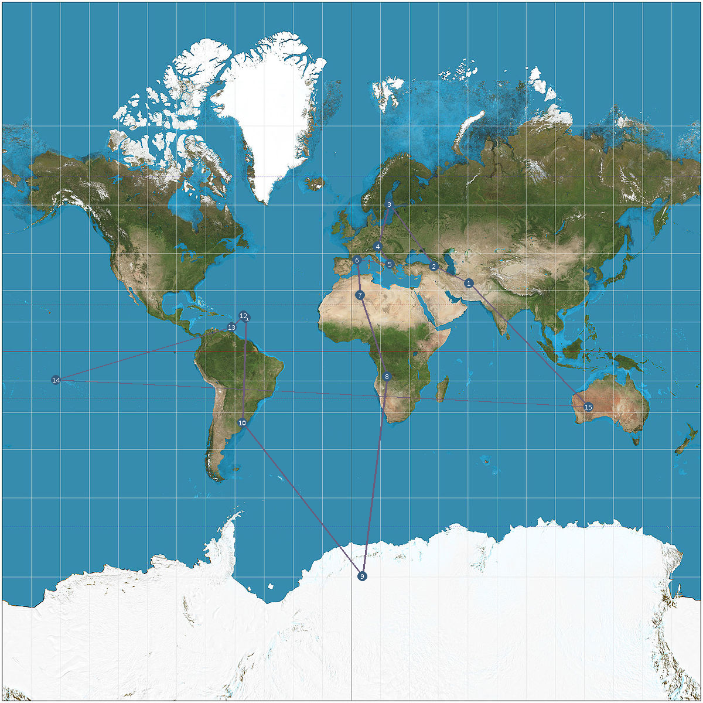

# TSP-DP-PARALLEL
Travelling Salesman Problem implementation solved using Dynamic Programming solution cutting worst subtree and result visualization.

## Table of contents
- [TSP-DP-PARALLEL](#TSP-DP-PARALLEL)
  - [Table of contents](#table-of-contents)
  - [General info](#general-info)
  - [Technologies](#technologies)
  - [Setup](#setup)
  - [How to use?](#how-to-use)
  - [Documentation](#documentation)
  - [License](#license)

## General info
This project is a simple implementation of TSP problem with world nations and result visualization.

## Technologies
Project is created with:

* [REST COUNTRIES](https://restcountries.eu/)
* [CImg](https://github.com/dtschump/CImg)
* [Robin-map](https://github.com/Tessil/robin-map)
* [nlohmann-json](https://github.com/nlohmann/json)
* [Doxygen](http://www.doxygen.nl/)
* [OpenMP](https://www.openmp.org/)

## Setup
To run this project

```
$ git clone https://github.com/freek9807/TSP-DP-PARALLEL.git
$ sudo apt install xorg
$ sudo apt-get install libomp-dev
$ sudo apt install curl
```

and after you should run:

```
$ cmake -G "Unix Makefiles"
$ make
```

## How to use?

When you have setup the project, you can run it with:

```
$ ./TSP <num-of-nations>
# e.g. ./TSP 10
```

The best result till now has been with an input of 19 cities. 
Execution output result:

```
------------------------------------------
|                     |        |         |
| City                | Lat    | Lng     |
|                     |        |         |
------------------------------------------
|         Afghanistan |  33.00 |   65.00 |
|       Åland Islands |  60.12 |   19.90 |
|             Albania |  41.00 |   20.00 |
|             Algeria |  28.00 |    3.00 |
|      American Samoa | -14.33 | -170.00 |
|             Andorra |  42.50 |    1.50 |
|              Angola | -12.50 |   18.50 |
|            Anguilla |  18.25 |  -63.17 |
|          Antarctica | -74.65 |    4.48 |
| Antigua and Barbuda |  17.05 |  -61.80 |
|           Argentina | -34.00 |  -64.00 |
|             Armenia |  40.00 |   45.00 |
|               Aruba |  12.50 |  -69.97 |
|           Australia | -27.00 |  133.00 |
|             Austria |  47.33 |   13.33 |
|          Azerbaijan |  40.50 |   47.50 |
|             Bahamas |  24.25 |  -76.00 |
|             Bahrain |  26.00 |   50.55 |
|          Bangladesh |  24.00 |   90.00 |
------------------------------------------

Execution Time : 4214.45 s

Min cost is: 64291.7

Afghanistan -> Bahrain -> Azerbaijan -> Armenia -> Åland Islands -> Austria -> Albania -> Andorra -> Algeria -> Angola -> Antarctica -> Argentina -> Aruba -> Antigua and Barbuda -> Anguilla -> Bahamas -> American Samoa -> Australia -> Bangladesh -> Afghanistan
Map has been printed!
```

With the associated image:



By default the limit is set to 10, if you want you can change it and run 'till 249 nations. If your memory, time and machine wants, obviously. :-)

## Documentation

You can generate documentation running:

```
$ doxygen doc.conf
```

it'll be generated in "docs/" folder (html and latex).

## License

[GNU GENERAL PUBLIC LICENSE](https://github.com/freek9807/TSP-DP-PARALLEL/blob/master/LICENSE) © [Federico Pennino](mailto:federico@freek.io?subject=[GitHub]%20TSP%20CPP)